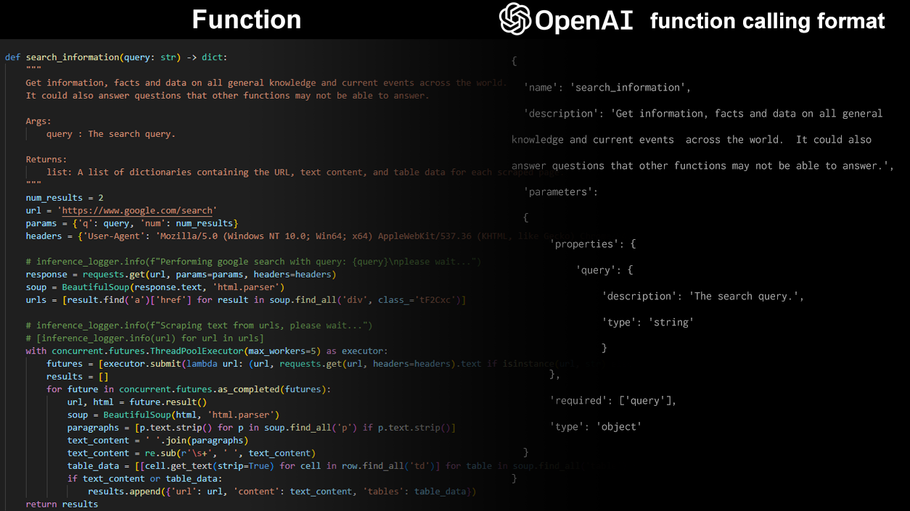

# Convert a Python function definition into its representation in the Openai tool calling template


 ## Introduction
 OpenAI has defined the LLM standard template for [tool calling](https://platform.openai.com/docs/assistants/tools/function-calling) . This helps ensure consistency across multiple LLMs and their fine tuned  / quantized versions as they too follow the same standard template for their function calling functionalities. Having a standard also helps inference platforms like [Ollama](https://ollama.com/) and [Llama.cpp](https://github.com/ggerganov/llama.cpp) use these templates to execute function calls on their platforms. Hence, it is super useful to maintain this template for all model training and fine-tuning experiments. <br />

This template is as below:
 
```
tools=[
    {
      "type": "function",
      "function": {
        "name": "get_current_temperature",
        "description": "Get the current temperature for a specific location",
        "parameters": {
          "type": "object",
          "properties": {
            "location": {
              "type": "string",
              "description": "The city and state, e.g., San Francisco, CA"
            },
            "unit": {
              "type": "string",
              "enum": ["Celsius", "Fahrenheit"],
              "description": "The temperature unit to use. Infer this from the user's location."
            }
          },
          "required": ["location", "unit"]
        }
      }
    }
```
<br />
 However, OpenAI weirdly, does not provide tools to directly convert a function definition into this template. Hence, everyone has to manually construct this template from their function, making that a time consuming process. This library seeks to automate this translation.
 
## Langchain
If you are using the Langchain framework, there is two in-built functions called **convert_to_openai_function** and **convert_to_openai_tool** formats . The difference is whether you decorate the function with the @tool decorator or not. Hence, if you are already using Langchain, you can directly import this functionality as follows:
```
from langchain_core.utils.function_calling import convert_to_openai_function , convert_to_openai_tool
```
This tool can convert both normal Python functions and tool objects. Tool objects are as:
```
from langchain.tools import tool

def get_name(name:str = 'Swaminathan', options:Literal['1','2','3','4'] = '1'):
  """
  This is the docstring of the function
 
  The string should contain valid, executable and pure Python code in markdown syntax.
  Code should also import any required Python packages.
 
  Args:
   name : The name of the person 
   options : The options that needs to be provided to the user
 
  Returns:
   str: A concatentation of the name and the option chosen
 
  Note:
   Use this function with caution, as executing arbitrary code can pose security risks.
  """
  print('Function is being called')
  return (name+'_'+str(options))

openai_representation = convert_to_openai_tool(function_example)
```
The representation of the tool in OpenAI is as follows:
```
{
  "type": "function",
  "function": {
    "name": "get_name",
    "description": "This is the docstring of the function\n\nThe string should contain valid, executable and pure Python code in markdown syntax.\nCode should also import any required Python packages.\n\nArgs:\n    name : The name of the person \n    options : The options that needs to be provided to the user\n\nReturns:\n    str: A concatentation of the name and the option chosen\n\nNote:\n    Use this function with caution, as executing arbitrary code can pose security risks.",
    "parameters": {
      "type": "object",
      "properties": {
        "name": {
          "default": "Swaminathan",
          "type": "string"
        },
        "options": {
          "default": "1",
          "enum": [
            "1",
            "2",
            "3",
            "4"
          ],
          "type": "string"
        }
      }
    }
  }
}
```
For a normal function, the template changes slightly as below:
```
{
  "name": "get_name",
  "description": "This is the docstring of the function The string should contain valid, executable and pure Python code in markdown syntax.\nCode should also import any required Python packages.",
  "parameters": {
    "type": "object",
    "properties": {
      "name": {
        "description": "The name of the person",
        "default": "Swaminathan",
        "type": "string"
      },
      "options": {
        "description": "The options that needs to be provided to the user",
        "default": "1",
        "enum": [
          "1",
          "2",
          "3",
          "4"
        ],
        "type": "string"
      }
    }
  }
}
```
However, if you are not using Langchain for the rest of your project, installing it for just this functionality makes no sense. This library acts as a substitute

**Personally, the issue was that I love using [Nous Research's](https://nousresearch.com/) [Hermes-2-Theta-Llama-3-8B model](https://huggingface.co/NousResearch/Hermes-2-Theta-Llama-3-8B) . However, for its function calling capabilities, [it seems to be trained on]([https://github.com/NousResearch/Hermes-Function-Calling](https://github.com/NousResearch/Hermes-Function-Calling/blob/main/functions.py)) Langchain's [tool calling template](https://python.langchain.com/v0.1/docs/modules/tools/) which was leading to some erroneous calls if I wasn't using the exact template** . Hence, I had to install the langchain-core library just to get this to work.

## Details
This library is partially based on Langchain's convert_to_openai_function and convert_to_openai_tool. However:
1. This library strips out a lot of the extraneous checks and balances that Langchain's function uses since it accomodates multiple types of inputs to this function. If you follow the template attached for your function definition, you should be fine.
2. Completely based on Pydantic v2.
3. I had quite a few issues with multiple changes to their codebase when I tried using their function such as multiple arguments to a function were not recognized, different types of objects were outputted depending on whether you were inputting a tool or a function. Hence, downstream accessibility to the output dictionary had to be parsed differently depending on whether you were using the function directly or as a tool.

## Usage
```
from function_to_openai_format import get_json_schema
tool_format = get_json_schema(function) # function is the name of your function. But it should not be a string. It should be a function object or a callable.
```

## Comparison between this function output and OpenAI format
### 1. Functions with one argument:
   ```
   def search_information(query: str) -> dict:
    """
    Get information, facts and data on all general knowledge and current events across the world. 
    It could also answer questions that other functions may not be able to answer.

    Args:
        query : The search query.

    Returns:
        list: A list of dictionaries containing the URL, text content, and table data for each scraped page.
    """
   num_results = 2
    url = 'https://www.google.com/search'
    params = {'q': query, 'num': num_results}
    headers = {'User-Agent': 'Mozilla/5.0 (Windows NT 10.0; Win64; x64) AppleWebKit/537.36 (KHTML, like Gecko) Chrome/94.0.4606.61 Safari/537.3'}
    
    # inference_logger.info(f"Performing google search with query: {query}\nplease wait...")
    response = requests.get(url, params=params, headers=headers)
    soup = BeautifulSoup(response.text, 'html.parser')
    urls = [result.find('a')['href'] for result in soup.find_all('div', class_='tF2Cxc')]
    
    # inference_logger.info(f"Scraping text from urls, please wait...") 
    # [inference_logger.info(url) for url in urls]
    with concurrent.futures.ThreadPoolExecutor(max_workers=5) as executor:
        futures = [executor.submit(lambda url: (url, requests.get(url, headers=headers).text if isinstance(url, str) else None), url) for url in urls[:num_results] if isinstance(url, str)]
        results = []
        for future in concurrent.futures.as_completed(futures):
            url, html = future.result()
            soup = BeautifulSoup(html, 'html.parser')
            paragraphs = [p.text.strip() for p in soup.find_all('p') if p.text.strip()]
            text_content = ' '.join(paragraphs)
            text_content = re.sub(r'\s+', ' ', text_content)
            table_data = [[cell.get_text(strip=True) for cell in row.find_all('td')] for table in soup.find_all('table') for row in table.find_all('tr')]
            if text_content or table_data:
                results.append({'url': url, 'content': text_content, 'tables': table_data})
    return results
   ```
#### OpenAI format:
```
{'name': 'search_information', 'description': 'Get information, facts and data on all general knowledge and current events across the world. \nIt could also answer questions that other functions may not be able to answer.', 'parameters': {'type': 'object', 'properties': {'query': {'description': 'The search query.', 'type': 'string'}}, 'required': ['query']}}
```
#### Using get_json_schema()
```
{'name': 'search_information', 'description': 'Get information, facts and data on all general knowledge and current events across the world. \nIt could also answer questions that other functions may not be able to answer.', 'parameters': {'properties': {'query': {'description': 'The search query.', 'type': 'string'}}, 'required': ['query'], 'type': 'object'}}
```
### 2. Functions with two arguments:
```
def clasp(a:int,b:int) -> int:
    """
    Get company profile and overview for a given stock symbol.

    Args:
        a : one integer
        b : another integer

    Returns:
        str : A string that confirms completion of function execution
    """
    c = a+b
    return c
```
#### OpenAI format:
```
{'name': 'clasp', 'description': 'Get company profile and overview for a given stock symbol.', 'parameters': { 'type': 'object', 'properties': {'a': {'description': 'one integer', 'type': 'integer'}, 'b': {'description': 'another integer', 'type': 'integer'}}, 'required': ['a', 'b']}}
```
#### Using get_json_schema()
```
{'name': 'clasp', 'description': 'Get company profile and overview for a given stock symbol.', 'parameters': { 'properties': {'a': {'description': 'one integer', 'type': 'integer'}, 'b': {'description': 'another integer', 'type': 'integer'}}, 'required': ['a', 'b'], 'type': 'object' }}
```
### 3. Functions with no arguments:
```
def introduction() -> str:
    """
    Get company profile and overview for a given stock symbol.

    Args:


    Returns:
        str : A string that confirms completion of function execution
    """
    stringer = 'Hello this is me !!!'
    print(stringer)
    return stringer
```
#### OpenAI format:
```
{'name': 'introduction', 'description': 'Get company profile and overview for a given stock symbol.', 'parameters': {'type': 'object', 'properties': {}}}
```
#### Using get_json_schema()
```
{'name': 'introduction', 'description': 'Get company profile and overview for a given stock symbol.', 'parameters': {'properties': {}, 'type': 'object'}}
```

## Note:

