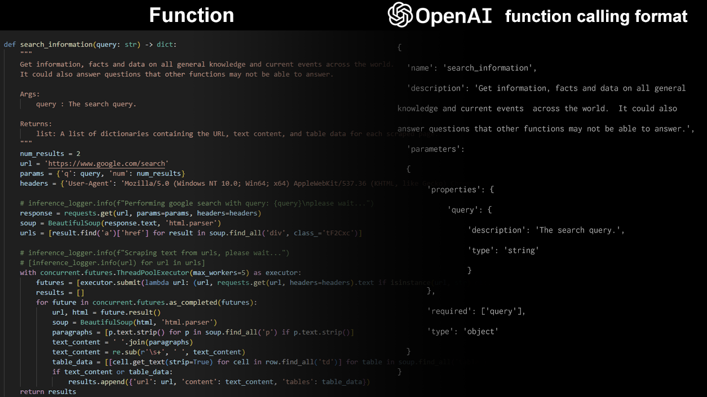

# Convert a Python function definition into its representation in the Openai tool calling template


 ## Introduction
 OpenAI has defined the LLM standard template for [tool calling](https://platform.openai.com/docs/assistants/tools/function-calling) . This helps multiple open-source fine tuners define the same standard template for their function calling models. It also helps inference support platforms like [Ollama](https://ollama.com/) and [Llama.cpp](https://github.com/ggerganov/llama.cpp) use these templates to execute function calls on their platforms. Hence, it is super useful to maintain this template for all model training and fine-tuning experiments.
 However, OpenAI weirdly, does not provide tools to directly convert a function definition into this template. Hence, everyone has to manually construct this template from their function, making that a time consuming process. An example of this template is as follows: <br />
 
```
tools=[
    {
      "type": "function",
      "function": {
        "name": "get_current_temperature",
        "description": "Get the current temperature for a specific location",
        "parameters": {
          "type": "object",
          "properties": {
            "location": {
              "type": "string",
              "description": "The city and state, e.g., San Francisco, CA"
            },
            "unit": {
              "type": "string",
              "enum": ["Celsius", "Fahrenheit"],
              "description": "The temperature unit to use. Infer this from the user's location."
            }
          },
          "required": ["location", "unit"]
        }
      }
    }
```
